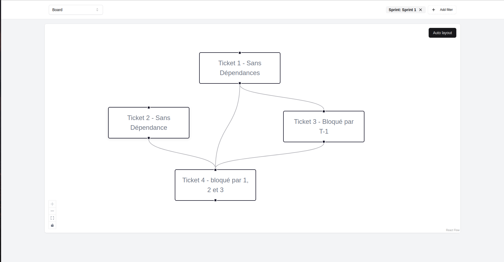

# Ticket Dependency Graph

Use this tool with your kanban to visualize the dependencies between your tickets.
**Supported tools**

- Notion

## Installation

```
git clone https://github.com/theodo/sprint-plan.git
cd sprint-plan
npm install
npm run dev
```

Development server should be running on `http://localhost:3000/`

## Deployment

***TODO: Setup Vercel Deployment***

## Usage

### With Notion


- Authorize the application to access the pages/databases of your choice
- Choose a database and apply a filter to fetch the tickets from your database
    - Fetch requests are not fired if the filter is empty
- Drag and drop from the source handle (bottom) to the target handle (top) to create a dependency between 2 tickets
- The dependency will be stored in a property "⚙️ Blocking Tickets" of the ticket
- To delete a dependency, simply click on a link and press backspace
- You can directly modify the dependencies within Notion by manually updating the property "⚙️ Blocking Tickets"
- Use the button "Auto layout" to automatically organize the tickets in a top-down dependency tree
